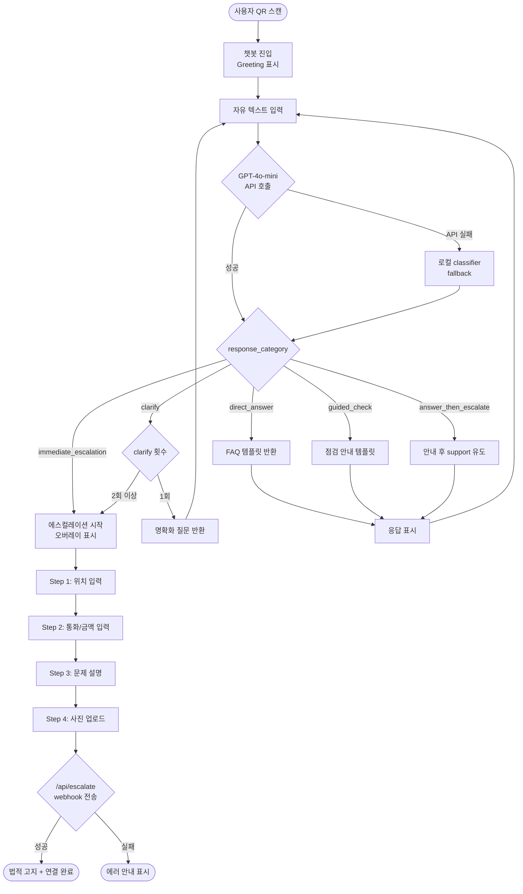
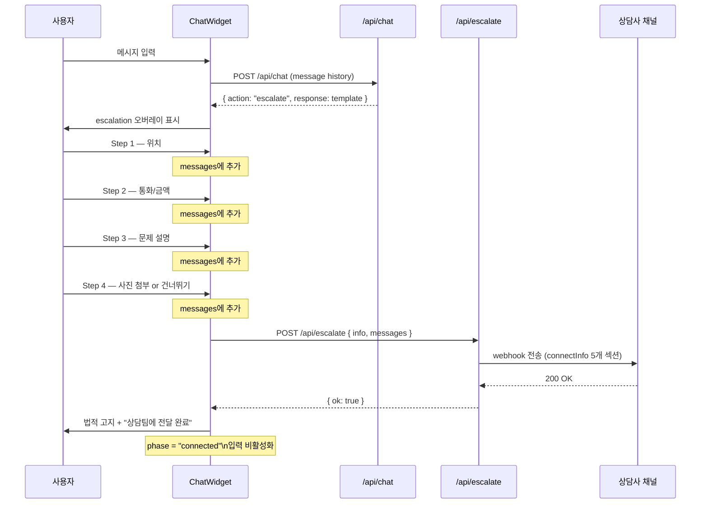
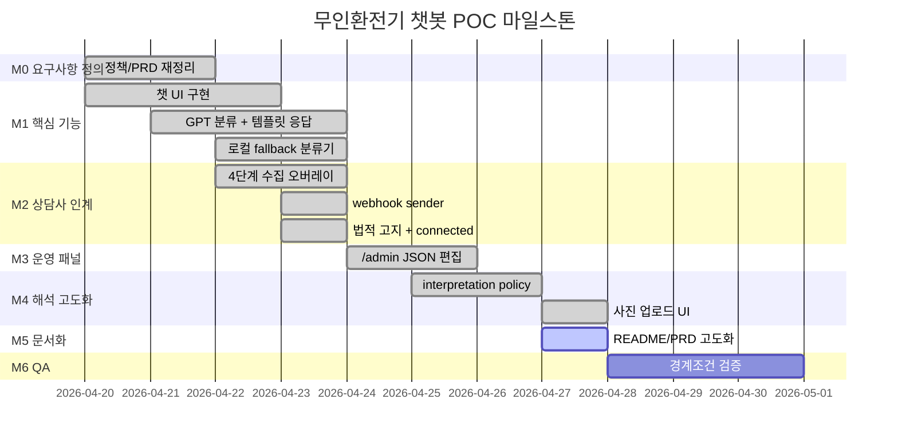

# PRD — 무인환전기 고객지원 AI 챗봇

**버전:** 1.1.0  
**상태:** POC (Proof of Concept)  
**최종 수정:** 2026-04-27  
**기획 단계:** 1차 (4월 4주차) + 2차 (4월 5주차) 반영

---

## 1. 문서 목적

본 문서는 무인환전기 고객지원용 AI 챗봇 POC의 목적, 범위, 요구사항, 운영 원칙, 마일스톤을 현재 구현된 레포 기준으로 정리하고, 이후 고도화 및 포트폴리오 문서화까지 고려할 수 있도록 구조화하는 것을 목적으로 한다.

현재 제품은 **분류형 AI + 템플릿 응답 + 상담사 인계 webhook 구조**를 채택하고 있으며, 자유 생성형 응답을 고객에게 직접 노출하지 않는 안전한 운영 방식을 핵심 원칙으로 삼는다.

---

## 2. 제품 개요

외국인 고객이 무인환전기에서 QR을 스캔한 뒤 접속하는 모바일 우선 웹 챗봇.

- 기본 사용법, 환율, 지원 통화, 권종, 점검형 문의를 즉시 확인 가능
- 금전·거래·환불 관련 이슈는 구조화된 정보 수집 후 상담사 인계
- `/admin` 패널에서 지식/정책 JSON을 코드 수정 없이 편집 가능

**현재 구현 스택:** Next.js 16.2.4 · TypeScript · Tailwind CSS v4 · OpenAI GPT-4o-mini · Vercel · Webhook

---

## 3. 문제 정의

현재 무인환전기 사용자는 여권 스캔 실패, 지폐 미인식, 금액 혼동 등 다양한 문제를 겪을 수 있으나, 모든 현장에 상담사가 상주하기 어렵다. 반대로 모든 문의를 사람 상담으로 라우팅하면 비용과 응답 지연이 커진다.

따라서 **일반 문의는 즉시 자동응답, 고위험 문의는 구조화된 정보 수집 후 상담사 인계**라는 이원화 구조가 필요하다. 이 제품은 `intent classification → template lookup → response / escalation` 구조로 이 문제를 해결한다.

---

## 4. 제품 목표

### 4-1. 비즈니스 목표

- 반복 FAQ를 자동응답으로 처리해 상담 부하 절감
- 고위험 문의만 선별적으로 상담사에게 연결
- 운영자가 코드 수정 없이 지식/정책 조정 가능
- 향후 운영 고도화의 기반 구조 확보

### 4-2. 사용자 목표

- 환전기 사용 중 즉시 도움이 필요한 정보를 빠르게 획득
- 거래성 이슈 발생 시 같은 채팅 내에서 정보를 제출하고 상담사 연결
- 동일 내용을 반복 입력하지 않도록 transcript continuity 유지

### 4-3. 운영 목표

- 고객 노출 응답은 승인된 템플릿만 사용
- 고위험 이슈는 직접 해결하지 않고 handoff
- OpenAI API 실패 시에도 로컬 분류기로 최소 기능 유지

---

## 5. 범위 정의

### In Scope

- AI intent classification
- Template-based response
- 4단계 escalation info collection
- Webhook 기반 상담사 알림
- 모바일 우선 챗 UI
- `/admin` 기반 정책·지식 JSON 편집

### Out of Scope

- 실제 환불 처리
- 실시간 기기 상태·머신 연동
- 사용자 식별 기반 다중 세션 관리
- 정식 analytics dashboard

---

## 6. 핵심 설계 원칙

1. GPT는 분류만 수행하고, 고객에게 보이는 텍스트는 모두 템플릿에서 가져온다.
2. 고위험 문의는 해결 시도 없이 즉시 escalation으로 분기한다.
3. 모호한 입력은 한 번의 clarify로 좁히고, 미해결 시 escalation한다.
4. OpenAI 실패 시 로컬 fallback classifier를 사용한다.
5. 개인정보는 서버에 저장하지 않고 브라우저 세션 내에만 유지한다.
6. 상담사 인계 후에는 법적 고지(산업안전보건법 제41조 관련 안내)를 노출한다.

---

## 7. 요구사항 정의

| 구분 | 중요도 | 요구사항 |
|------|--------|---------|
| **사용자 인터페이스** | P0 | 챗봇은 최초 진입 시 서비스 성격을 알리는 greeting을 보여야 한다 |
| | P0 | 사용자는 자유 텍스트를 입력할 수 있어야 한다 |
| | P0 | 응답 대기 중 loading state가 보여야 한다 |
| | P0 | 모바일에서 입력 UX가 깨지지 않아야 하며, iOS Safari zoom 이슈를 방지해야 한다 |
| | P0 | 챗봇 응답은 AI 응답임을 시각적으로 구분할 수 있어야 한다 |
| | P1 | FAQ 응답·clarify 응답·escalation 진입 상태가 시각적으로 구분되어야 한다 |
| | P1 | escalation 진입 시 일반 입력창 대신 정보 수집용 오버레이를 보여야 한다 |
| | P1 | 사진 수집 단계에서 텍스트 입력 대신 카메라 촬영·갤러리 업로드·건너뛰기 버튼을 제공해야 한다 |
| | P2 | 데스크톱에서는 프레임형 미리보기, 모바일에서는 풀스크린 최적화 UI를 제공한다 |
| **AI 분류 및 응답** | P0 | 사용자의 입력은 GPT-4o-mini로 intent 분류되어야 한다 |
| | P0 | 분류 결과는 structured JSON 형태여야 한다 |
| | P0 | 분류 결과는 5개 response category 중 하나로 매핑되어야 한다 |
| | P0 | 고객에게 보이는 답변은 반드시 pre-approved template이어야 한다 |
| | P0 | GPT가 생성한 자유 텍스트는 고객에게 직접 노출되면 안 된다 |
| | P1 | ambiguous input에 대해 single clarify question을 반환해야 한다 |
| | P1 | high-risk intent는 direct answer를 시도하지 않고 즉시 escalation으로 분기해야 한다 |
| | P1 | OpenAI API 사용 불가 시 local rule-based classifier로 fallback해야 한다 |
| | P2 | low-risk FAQ에 대해 semantic interpretation 확장을 위한 정책 보강이 가능해야 한다 |
| **응답 카테고리** | P0 | `direct_answer`: 안전한 정보형 FAQ에만 사용 |
| | P0 | `guided_check`: 1차 점검 안내만 허용 |
| | P0 | `clarify`: 짧고 모호한 입력에만 사용 |
| | P0 | `answer_then_escalate`: 점검형·설명형 이슈에 한해 사용 |
| | P0 | `immediate_escalation`: 금전·거래·환불·불만·사람 연결 요청에 사용 |
| | P1 | 18개 intent는 현재 정의된 카테고리 매핑을 유지해야 한다 |
| **상담사 인계** | P0 | escalation 조건이 충족되면 handoff flow가 시작되어야 한다 |
| | P0 | 사용자는 4단계로 구조화된 정보를 입력해야 한다: 위치 → 통화/금액 → 문제 설명 → 사진 |
| | P0 | 수집된 정보는 기존 message history에 추가되어 transcript continuity를 유지해야 한다 |
| | P0 | 최종적으로 full conversation history와 collected info를 webhook으로 전송해야 한다 |
| | P0 | webhook 성공 시 handoff confirmation을 보여주고 입력을 종료해야 한다 |
| | P1 | webhook 실패 또는 미설정 시 에러를 보여주고 대체 안내를 제공해야 한다 |
| | P1 | 상담사 인계 성공 시 법적 고지 문구를 보여줘야 한다 |
| | P2 | 향후 same-chat human agent join 구조로 고도화할 수 있도록 세션 구조를 분리 설계한다 |
| **관리자/운영** | P0 | `/admin`에서 knowledge base·AI policy·specific rules·escalation rules·AI guidelines 조회/수정 가능 |
| | P0 | JSON은 저장 전 검증되어야 하며 invalid JSON은 reject해야 한다 |
| | P1 | 운영자가 코드 배포 없이 문구·정책·지식을 조정할 수 있어야 한다 |
| | P2 | 향후 인증 없는 admin panel은 보안상 고도화 대상이다. 현재는 POC 한계로 관리한다 |
| **데이터 및 상태관리** | P0 | chat message는 id·role·content·timestamp를 포함해야 한다 |
| | P0 | escalation info는 location·currencyAndAmount·problem·photo 필드를 가져야 한다 |
| | P0 | phase state는 `chat → collecting → submitting → connected` 흐름을 지원해야 한다 |
| | P1 | 페이지 새로고침 시 세션이 유지되지 않는 현재 제약을 문서화해야 한다 |
| | P2 | 향후 세션 persistence 및 운영 로그 구조 확장을 고려할 수 있어야 한다 |
| **비기능** | P0 | 키오스크 챗은 24/7 접근 가능해야 한다 |
| | P0 | 사람 상담 운영시간은 08:00–17:00 KST 기준으로 안내되어야 한다 |
| | P0 | API 키는 환경변수로 보호되어야 하며 클라이언트에 노출되면 안 된다 |
| | P0 | 서버에 사용자 PII를 저장하지 않아야 한다 |
| | P1 | 일반 응답 latency 목표는 3초 이내여야 한다 |
| | P1 | 모바일 우선 접근성을 확보해야 한다 |
| | P2 | 다국어 UI·챗봇 확장은 이후 단계 과제로 정의한다. 현재 POC는 영어 UI 중심이다 |
| **정책/리스크** | P0 | transaction outcome·refund eligibility·machine failure는 확정적으로 답하면 안 된다 |
| | P0 | 지원하지 않는 정책·수치·조건을 임의로 생성하면 안 된다 |
| | P0 | high-risk false direct answer는 허용되지 않는다 |
| | P1 | wording variation으로 인한 unnecessary escalation을 줄이기 위해 phrase expansion 및 semantic interpretation 개선이 가능해야 한다 |
| | P2 | intent별 precision/recall 기반 threshold 조정 정책을 차후 운영 고도화 항목으로 둔다 |

---

## 8. 응답 범위 및 Intent 목록

### Safe Direct Answer (6개)

| Intent | 설명 |
|--------|------|
| `service_intro` | 서비스 소개 |
| `basic_usage` | 기본 사용법 |
| `business_hours` | 운영시간 안내 |
| `supported_languages` | 지원 언어 안내 |
| `exchange_rate_basis` | 환율 기준 안내 |
| `rounding_rule` | 절사 규칙 안내 |

### Guided / Troubleshooting (4개)

| Intent | 설명 |
|--------|------|
| `banknote_not_accepted` | 지폐 미인식 점검 안내 |
| `passport_scan_failed` | 여권 스캔 실패 점검 안내 |
| `screen_stuck` | 화면 멈춤 점검 안내 |
| `qr_access_issue` | QR 접속 문제 점검 안내 |

### Answer Then Escalate (1개)

| Intent | 설명 |
|--------|------|
| `amount_general_explanation` | 금액 일반 설명 후 support 유도 |

### Immediate Escalation (7개)

| Intent | 설명 |
|--------|------|
| `money_not_reflected` | 투입 금액 미반영 |
| `refund_request` | 환불 요청 |
| `duplicate_charge` | 중복 차감 |
| `amount_issue_individual_case` | 개별 금액 이슈 |
| `transaction_result_check` | 거래 결과 확인 |
| `complaint_or_claim` | 불만·이의 제기 |
| `human_agent_request` | 사람 연결 요청 |

---

## 9. 다이어그램

### 9-1. 전체 처리 플로우



### 9-2. 상담사 인계 시퀀스



### 9-3. 마일스톤 Gantt



---

## 10. AI 해석 강화 정책 (2차 기획 — 4월 5주차)

2차 기획에서 정의된 해석 강화 정책은 `data/ai_policy.json`에 반영되어 있다. 주요 정책 요약:

### 10-1. interpretation_expansion_policy
짧거나 비공식적인 입력을 과도한 escalation 없이 해석하기 위한 정책.

- 키워드 정확 매칭에만 의존하지 않고 semantic similarity 기반 해석 적용
- 파편화된 문장·구어체·오타·어순 변형 등 7개 변형 유형 지원
- 예시: `"cash keeps coming back"` → `banknote_not_accepted`, `"passport no read"` → `passport_scan_failed`

### 10-2. semantic_fallback_policy
정확 매칭 실패 시 escalation 전 semantic 후보 intent 평가.

```
exact_match → near_exact_match → semantic_top_candidates
    → disambiguation_clarify → safe_direct_answer_or_escalation
```

- low-risk FAQ: 충분히 가까우면 direct_answer
- medium-risk: disambiguation clarify 우선
- high-risk: clarify 또는 escalation (low-risk direct answer 강제 불가)

### 10-3. disambiguation_clarify_policy
여러 intent가 감지될 때 이지선다형 명확화 질문 사용.

- 최대 3개 선택지 제시, binary choice 선호
- high-risk 후보가 있으면 해당 해석을 명시적으로 포함
- 예시: `"less money"` → "받은 금액이 예상보다 적었나요, 아니면 투입 금액이 반영되지 않았나요?"

### 10-4. intent_specific_threshold_policy
intent 리스크 수준별 분기 임계값 차등 적용.

| 그룹 | direct_answer 임계값 | clarify 임계값 | escalate 임계값 |
|------|---------------------|----------------|----------------|
| low_risk_faq | 0.70 | 0.50 | < 0.50 |
| medium_risk_troubleshooting | 0.80 | 0.55 | < 0.55 |
| high_risk_transaction | 0.95 | 0.75 | < 0.75 |

### 10-5. confusion_pair_policy
자주 혼동되는 intent 쌍에 대한 전용 disambiguation 처리.

| 혼동 쌍 | 처리 방식 |
|---------|----------|
| amount_general_explanation ↔ amount_issue_individual_case | clarify |
| screen_stuck ↔ transaction_result_check | clarify_or_escalate |
| exchange_rate_basis ↔ amount_issue_individual_case | clarify |

### 10-6. low_risk_rescue_policy
low-risk FAQ에 대한 불필요한 escalation 방지.

- 파편화된 표현이나 짧은 비공식 표현만으로는 escalation을 강제하지 않음
- 예시: `"how use"` → `basic_usage` direct_answer, `"rate pls"` → `exchange_rate_basis` direct_answer

---

## 11. 마일스톤 정리

### M0. 요구사항 재정의 / 정책 정리
- 현재 구현과 정책 문서를 일치시킨다
- direct answer / escalation / fallback 범위 확정
- 포트폴리오용 PRD 구조 재설계

### M1. 핵심 챗봇 기능 구현 ✅
- chat UI, `/api/chat`, GPT classification
- template lookup, local classifier fallback

### M2. 상담사 인계 기능 구현 ✅
- 4단계 info collection, webhook sender
- 법적 고지, connected state

### M3. 운영 패널 구축 ✅
- `/admin`, JSON edit / validation
- 운영자 정책 수정 구조 확보

### M4. 해석 강화 및 UI 고도화 ✅
- interpretation expansion / semantic fallback / disambiguation 정책 반영
- 사진 수집 단계 카메라·업로드 버튼 UI로 교체

### M5. 문서/포트폴리오 고도화 (진행 중)
- README 한국어 고도화
- PRD v1.1 (현재 문서)
- Mermaid 다이어그램

### M6. QA 및 경계조건 검증
- FAQ·ambiguity·troubleshooting·high-risk escalation 케이스 검증
- webhook fail·local fallback·자유 생성 텍스트 미노출 검증

---

## 12. 오픈 이슈

| 항목 | 현황 | 비고 |
|------|------|------|
| 다국어 챗봇 | 미구현 (영어 UI 중심) | 다음 단계 과제 |
| 세션 persistence | 새로고침 시 초기화 | POC 한계 |
| admin 인증 | 없음 | POC 한계, 고도화 필요 |
| 실시간 기기 연동 | 없음 (하드코딩) | 다음 단계 과제 |
| AGENT_WEBHOOK_URL | 배포별 수동 설정 필요 | `.env.local` 또는 Vercel env 설정 |

---

## 13. 한 줄 정의

> 무인환전기 사용자 문의를 AI로 분류하고, 고객에게는 승인된 템플릿만 노출하며, 금전·거래·환불 이슈는 구조화된 정보 수집 후 상담사에게 안전하게 인계하는 모바일 우선 지원 챗봇.
